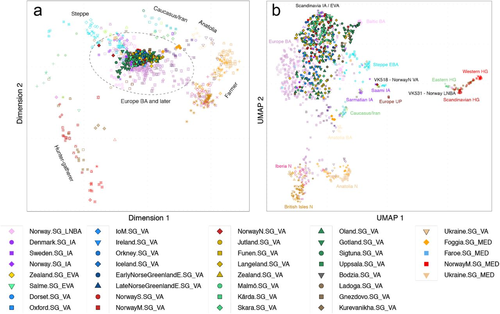

```{r setup, include=FALSE}
knitr::opts_chunk$set(echo = FALSE)
```

## PCA vs. MDS

- We often use **PCA** with **modern reference** populations to get a first idea about the ancestry components of aDNA samples
- Another approach to visualize relationships in the high-dimensional genetic space, is to use **multidimensional scaling** (MDS) methods on **pairwise distance** matrices with **only ancient samples**
- Others have demonstrated this approach successfully

## Margaryan et al. 2019: Population genomics of the Viking world



## My exploration (with significant help by Joscha)

- Data: European and Near Eastern subset with samples between 7500 and 500 calBC from the (old) 1240K+HumanOrigins dataset
- Steps:

```
# pruning (removing region with much linkage disequilibrium)
plink --file 1240K_HumanOrigins --exclude code/mds/myrange.txt 
--range --maf --make-bed --out 1240K_HumanOrigins.pruned

# generate pairwise IBS distance (1 - F2)
plink --bfile 1240K_HumanOrigins.pruned --genome 
--out 1240K_HumanOrigins.pruned

# calculate MDS from input distance matrix
plink --bfile 1240K_HumanOrigins.pruned --cluster --mds-plot 4 
--read-genome 1240K_HumanOrigins.pruned.genome 
--out 1240K_HumanOrigins.pruned
```

## First result


## Removing outliers (95% range for each of the 4 dimensions)


## Comparison with PCA


## Comparison with PCA


# Properties of the MDS outliers


